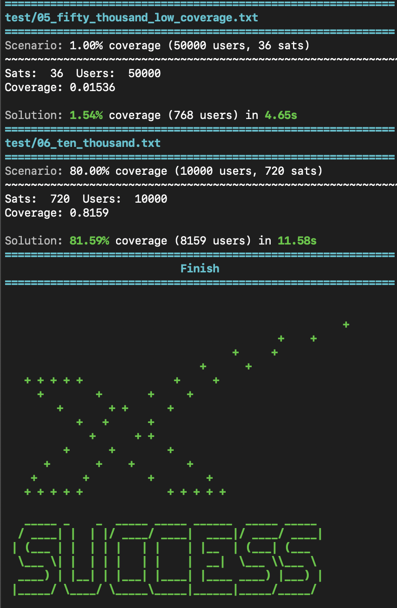

# Starlink Beam Planner

To provide internet to a user, a satellite forms a "beam" towards that user and the user forms a beam towards the satellite. After doing this the satellite and user can form a high-bandwidth wireless link.

Starlink satellites are designed to be very flexible. For this problem, each satellite is capable of forming up to 32 independent beams simultaneously. Therefore one Satellite can serve up to 32 users. Each beam is assigned one of 4 "colors" corresponding to the frequencies used to communicate with that user.

There are a few constraints on how those beams can be placed:
- From the user's perspective, the beam serving them must be within 45 degrees of vertical. Assume a spherical Earth, such that all surface normals pass through the center of the Earth (0, 0, 0).
- On each Starlink satellite, no two beams of the same color may be pointed within 10 degrees of each other, or they will interfere with one another.

## Problem 
Given a list of users and satellites, assign beams to users respecting the constraints above. Some test cases have more users than can be physically served. Do your best while remaining reasonably efficient.

Your solution will be run on a number of test cases. Each case includes a minimum number of users that **must** be served. Constraint violations, crashes, unhandled exceptions, serving less than the minimum number of users, or taking longer than the time limit will all result in failure.
|        | Users      | Satellites  | Min Coverage |
|--------|------------|--------------|---|
| Case 1 | 2          | 1            | 100%         |
| Case 2 | 5          | 1            | 80%          |
| Case 3 | 1000       | 64           | 95%          |
| Case 4 | 5000       | 700          | 80%          |
| Case 5 | 50000      | 36           | 1%           |
| Case 6 | 10000      | 720          | 80%          |

## Usage
Solution implemented in Python in `solution.py`. Only Python standard library and anything provided in `util.py` was used, no other third party libraries.

Run `make` within the `/py` folder to run all tests.

Test results will be printed to the console. This includes user coverage and runtime as well as failure to satisfy constraints.

